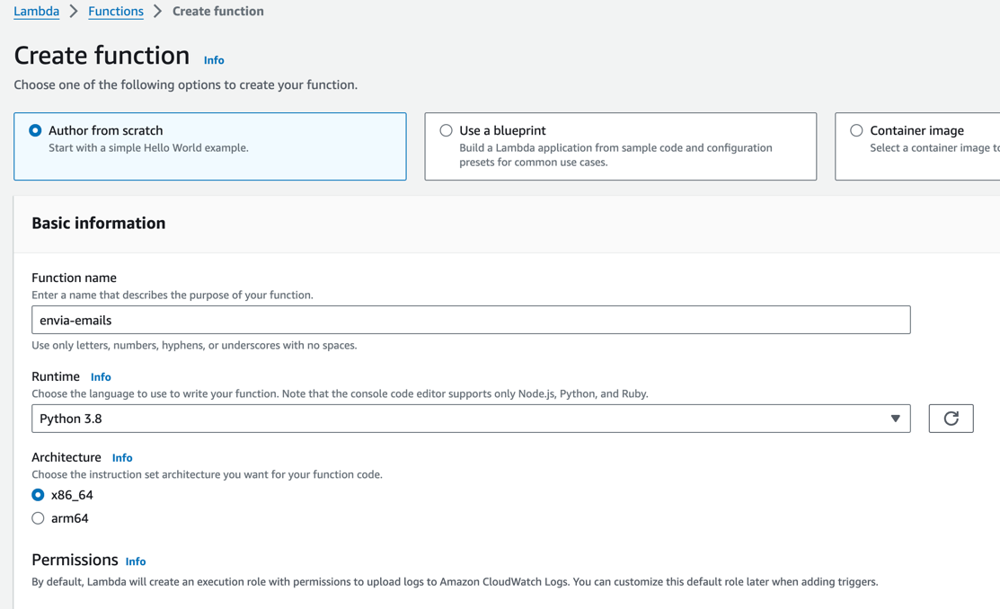
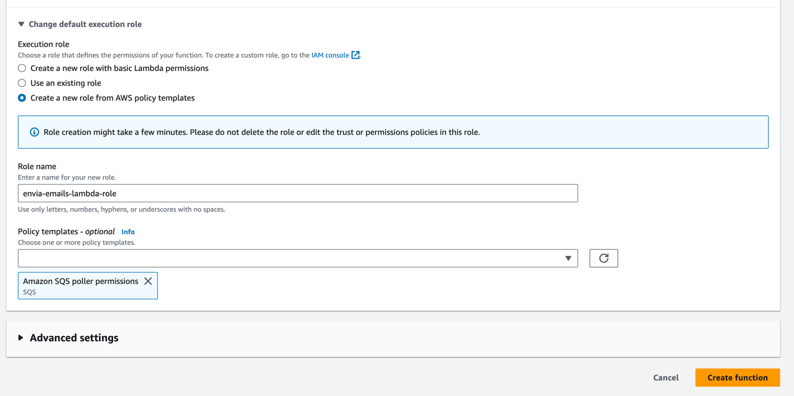
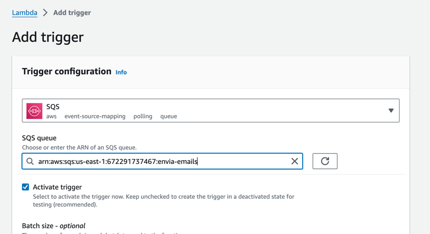
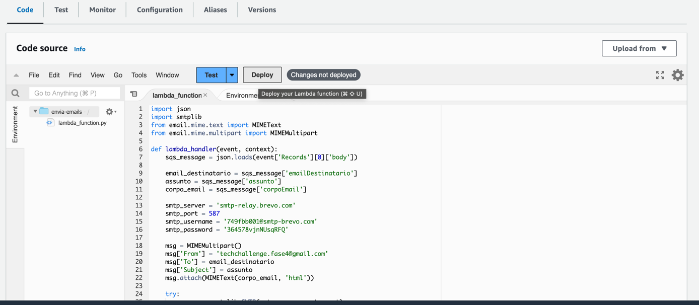

# envia-emails-app

Para criar a lambda na AWS siga os passos abaixo.

1 - Acesse o console e procure por AWS Lambda. Clique em Criar Lambda. Preencha as informações necessárias conforme passo a passo abaixo:

**Functiona name:** envia-emails

**Runtime:** Python 3.8

Clique em **Change default execution role** e selecione a opção **Create a new role from AWS policy templates**

**Role name:** envia-emails-lambda-role

Em policy templates procure por SQS e adicione o **poller permissions**, isso fará com que a lambda tenha permissão para acessar a fila SQS.

2 - Adicione um trigger, que será a fila SQS

3 - Cole o código da lambda na aba **Code** e clique em **Deploy**
